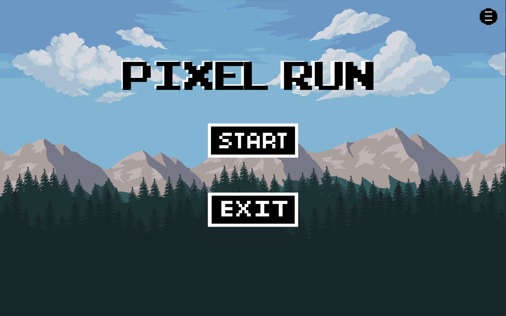
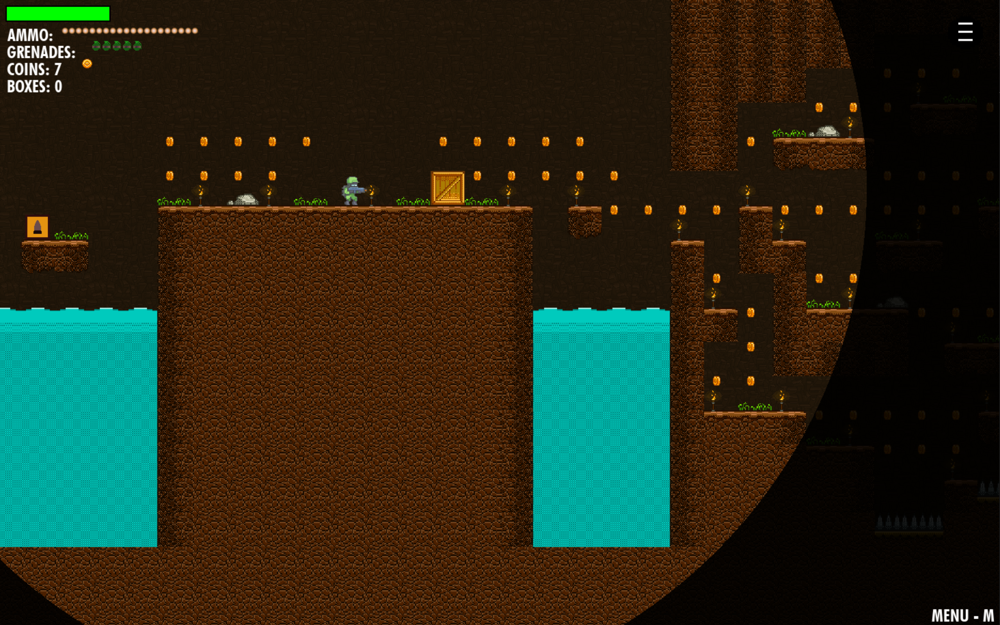
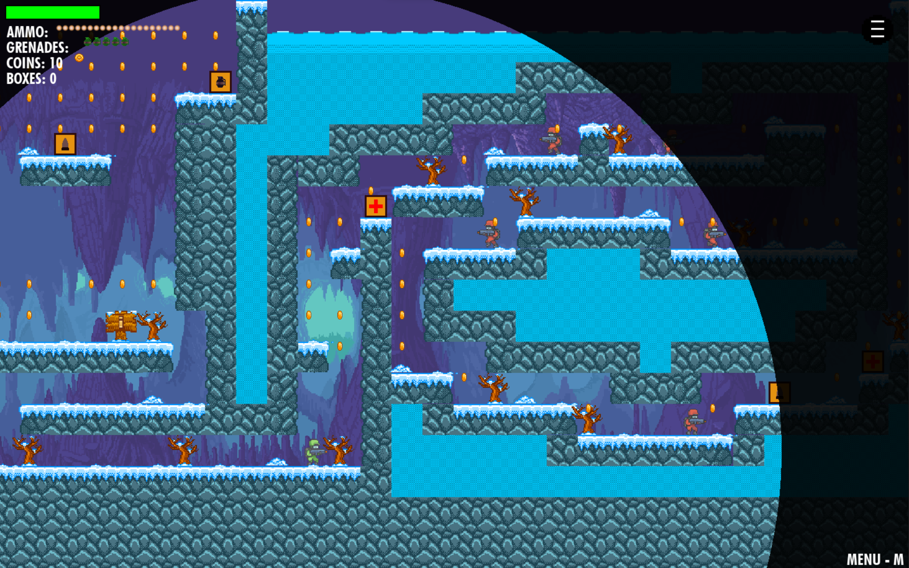
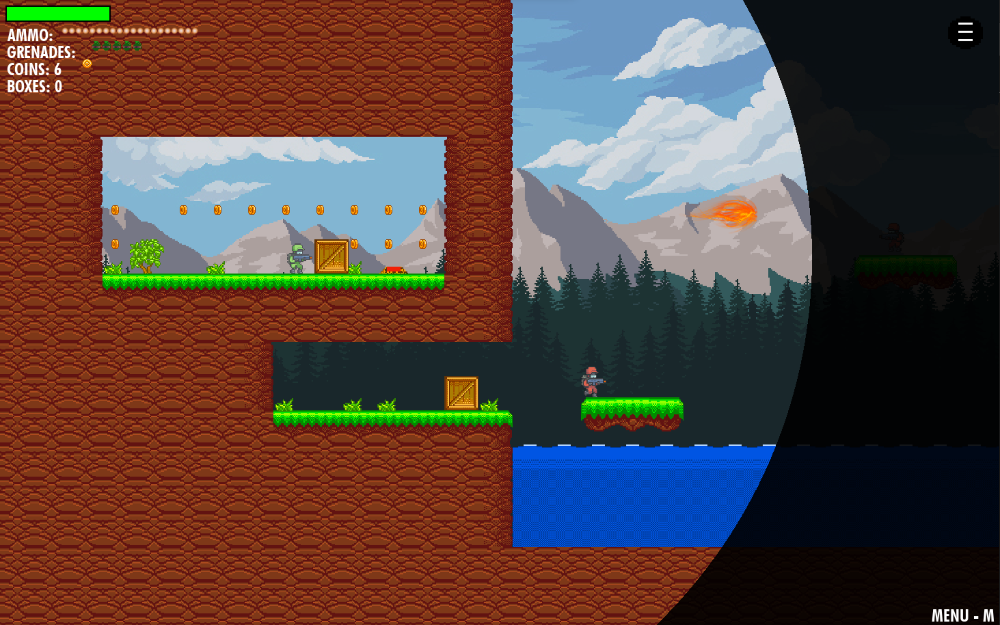
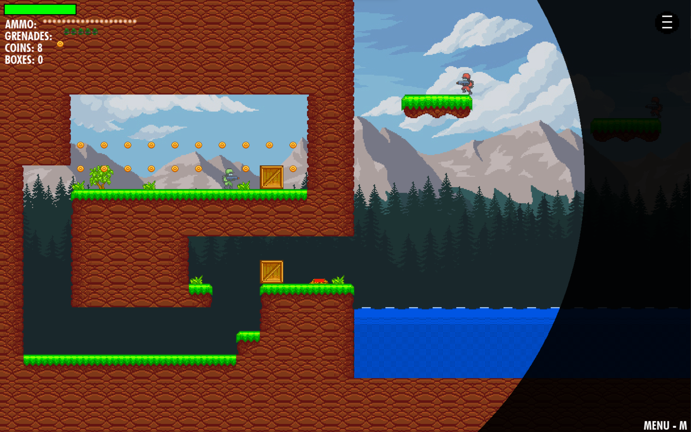
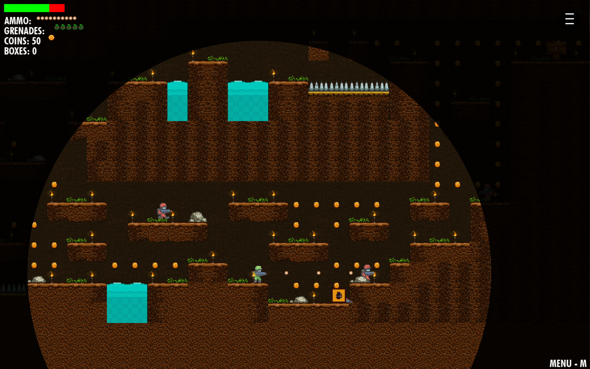
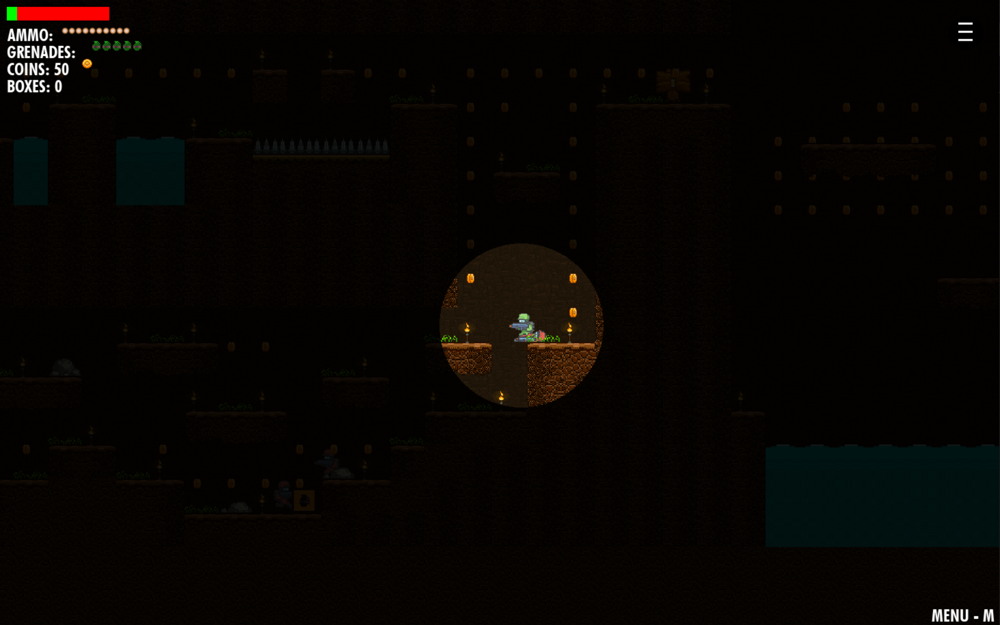

# Pixel Run 🎮

This is a platformer game with multiple levels, where the player is a shooter that has to get to the end of the maze without getting shot by opponents or without getting caught off guard by the various traps hidden in his way. 

## Game Features 🕹️

- **Easy Controls:** Just a few buttons to jump and move.

- **Different Levels:** Each level has its own challenges. Can you get through them all?

- **Collect Coins:** Grab coins and power-ups to increase your chances of survival in the game.

- **Hidden Tunnels:** Discover the hidden tunnels that provide you with a shortcut through the maze.

- **Dodge enemy bullets:** Move fast so the guards don't have the chance to see you.

- **Stay in the light:** Everytime you get hit or shot, your player's view gets smaller and smaller, it gets darker and darker in the maze, until you cannot see a thing.

  

## How to Play 🚀

1. **Move Around:** Use ad keys to control the player right and left.
2. **Jump:** Use w to jump.
3. **Get Things:** Pick up coins and power-ups for points and unlocking items.
4. **Finish Levels:** Beat the challenges to move on to the next level.

Join in on the challenge and see if you can beat all levels! 🌟

## Technical aspects 🕹️
- Fully developed in python using pygame
- The levels are encoded CSV files, where each value represents a certain tile loaded in at the beggining of the game.
- the enemies have implemented some AI features, where they shoot when they detect a player in their immediate range and open fire.
- Gravity is implemented into the game using simple algorithms.
- Heavily relies on OOP principles in its implementation.

### To complete the project or play the game right away download these resources ( images, sound files  + executable )
- https://drive.google.com/drive/folders/1uhkYCsryzUrtI8d4FWPY9idvwNGd3MbX?usp=sharing

